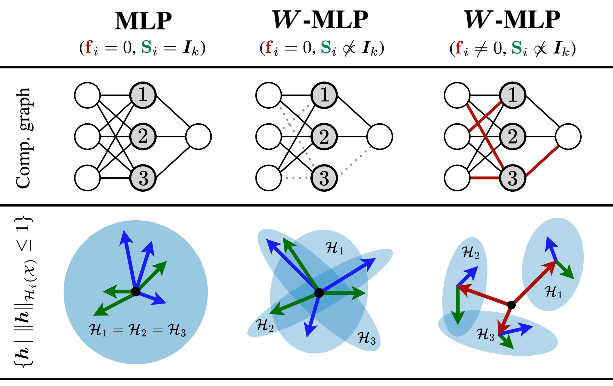
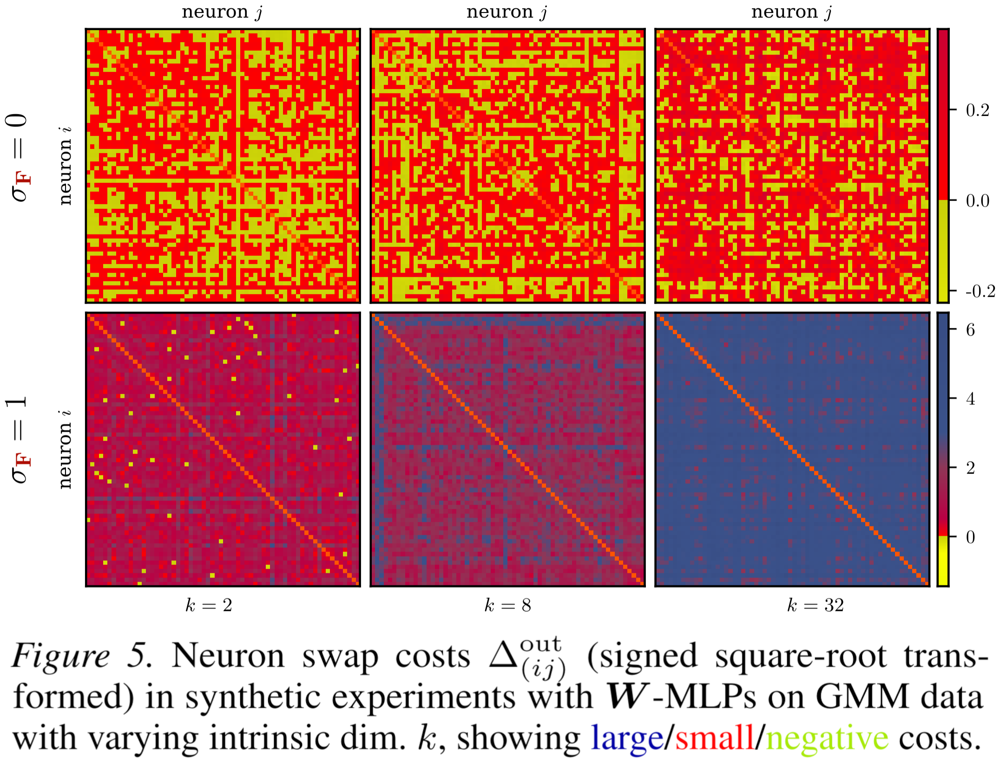

## Beyond Structural Symmetries: Linear Mode Connectivity via Neuron Identifiability

by Vincent Bürgin* ¹, Daniel Herbst* ¹, Ya-Wei Eileen Lin¹, Stefanie Jegelka¹². (¹: TU Munich, ²: MIT).

To appear at ICML 2026.

arXiv: [https://arxiv.org/abs/2606.04754](https://arxiv.org/abs/2606.04754)



***Abstract:***

> *Many striking phenomena in deep learning, such as linear mode connectivity and the structured behavior of training dynamics, are closely tied to parameter symmetries: transformations that leave the realized function unchanged. Despite growing attention to parameter symmetries, the exact interplay between parameters, data, and representations remains underexplored. To investigate this, we develop a theoretical framework of effective function classes, i.e., the set of functions a neuron can realize on its input support, and the norm cost of realizing them. We then formalize effective symmetry breaking via neuron identifiability across independent training runs. Our analysis shows that neural networks can admit large families of approximately equivalent solutions even in structurally asymmetric models. We further show that neuron identifiability enables representation merging without prior alignment, and characterize when such merging admits a linear low-loss path. These findings highlight the role of effective function classes in affecting the loss landscape.*



### Running the code

1. **Install the environment** using [*pixi*](https://pixi.prefix.dev/latest/#installation): `pixi install`

2. **Start a training run:**

```bash
# Train one set of models (W-MLPs, sigma_F = 1)
pixi run python train.py num_models=4 logging=console --config-name mlp_symmetry1_kappa1_noInterpolation
```

This trains four ***W***-MLPs with fixed weight scale $1$ and compatible masks (i.e., ***D*** and ***F*** will be the same for the four models, so that they can be interpolated). You will now find trained model checkpoints in `outputs/`. In the codebase, `symmetry0` refers to standard (non-asymmetric) models, `symmetry1` to ***W***-asymmetric models, `symmetry2` to $\sigma$-asymmetric models, and `symmetry3` to *syre*-asymmetric models. The fixed weight scale $\sigma_{\mathbf F}$ is denoted `kappa`.

3. **Train more models in different settings, so we can analyze them:** To additionally train standard MLPs, ***W***-MLPs with zero fixed weights, and *syre*-MLPs, run:

```bash
# Train three more sets of models:

# Standard MLPs
pixi run python train.py num_models=4 logging=console --config-name mlp_symmetry0_noInterpolation

# W-MLPs, sigma_F = 1
pixi run python train.py num_models=4 logging=console --config-name mlp_symmetry1_kappa1_noInterpolation

# syre-MLPs, sigma_F = 1
pixi run python train.py num_models=4 logging=console --config-name mlp_symmetry3_kappa1_noInterpolation
```

Now you should have directories with model checkpoints under `outputs/`.

4. **Edit `checkpoint_directories.py`** to include paths to your newly trained models. The dictionary `checkpoint_directories.checkpoint_directories_by_architecture` groups runs by architecture, and its sub-dictionaries map human-readable keys to run directories. You can use `src/eval/group_models_helper.ipynb` to help you produce this dictionary. Example:

```python
{
  # ...
  "mlp": {
    "mlp_symmetry0": "/absolute/path/to/run/directory1",
    "mlp_symmetry1_kappa0": "/absolute/path/to/run/directory2",
    "mlp_symmetry1_kappa1": "/absolute/path/to/run/directory3",
    "mlp_symmetry3_kappa1": "/absolute/path/to/run/directory4",
  },
  # ...
}
```

In the next step, the `--architecture` flag will refer to the keys of the `checkpoint_directories` dictionary defined above, and the run keys defined therein are used to identify different types of models.

5. **Run analysis scripts on the trained models:**

```bash
# a) Aligned and unaligned LMC:
pixi run python -m src.eval.measure_lmc_unaligned_aligned \
  --architecture mlp --output-file outputs/lmc-results-mlp.json

# b) Activation matching objectives:
pixi run python -m src.eval.measure_activation_matching_objective \
  --architecture mlp --output-file outputs/activation-matching-results-mlp.json

# c) Neuron realization and pairwise swap costs (Mahalanobis estimate):
pixi run python -m src.eval.measure_realization_cost \
  --architecture mlp --output-file outputs/realization-costs-mlp.parquet

# d) Neuron realization and pairwise swap costs (ridge regression estimate):
pixi run python -m src.eval.measure_realization_cost_ridge_regression \
  --architecture <ridge-architecture> --epoch <epoch> --inner-iterations <inner-iterations> \
  --num-neurons <num-neurons> --num-neuron-pairs <num-neuron-pairs> \
  --output-file outputs/ridge-regression-realization-costs-mlp.parquet

# e) Subspace coherence of intermediate representations:
pixi run python -m src.eval.measure_subspace_coherence \
   --architecture mlp --output-file outputs/subspace-coherence-mlp.json
```

To reproduce the ridge regression estimates from the paper, first train or provide the corresponding batch-norm ridge-regression experiment checkpoints, add these run directories to `checkpoint_directories.py` under the architecture key passed as `<ridge-architecture>`, and pass explicit values for `<epoch>`, `<inner-iterations>`, `<num-neurons>`, and `<num-neuron-pairs>`.

6. **Run the synthetic coherence experiment:**

```bash
pixi run python train.py --config-name synthetic_coherence
```

By default, this writes result JSON files and figures under `outputs/synthetic-coherence/`.

### Organization

The environment is managed by `pixi`.

`train.py` is the main training script.

`src/models` contains symmetric and asymmetric models, in particular `mlp.py`, `resnet.py`.

`src/utils` contains various utilities, in particular `interpolation.py` and `record_activations.py`.

`src/utils/rebasin` contains rebasining code, in particular `activation_matching.py`.

`src/eval` contains analysis scripts used to obtain our experimental results: `measure_*.py` (usage see above).

`plots.py` contains code to generate plots from the result files output by the analysis scripts.

Initial version of the codebase based on https://github.com/cptq/asymmetric-networks (Lim*, Putterman*, Walters, Maron & Jegelka 2024: *The Empirical Impact of Neural Parameter Symmetries, or Lack Thereof*)
